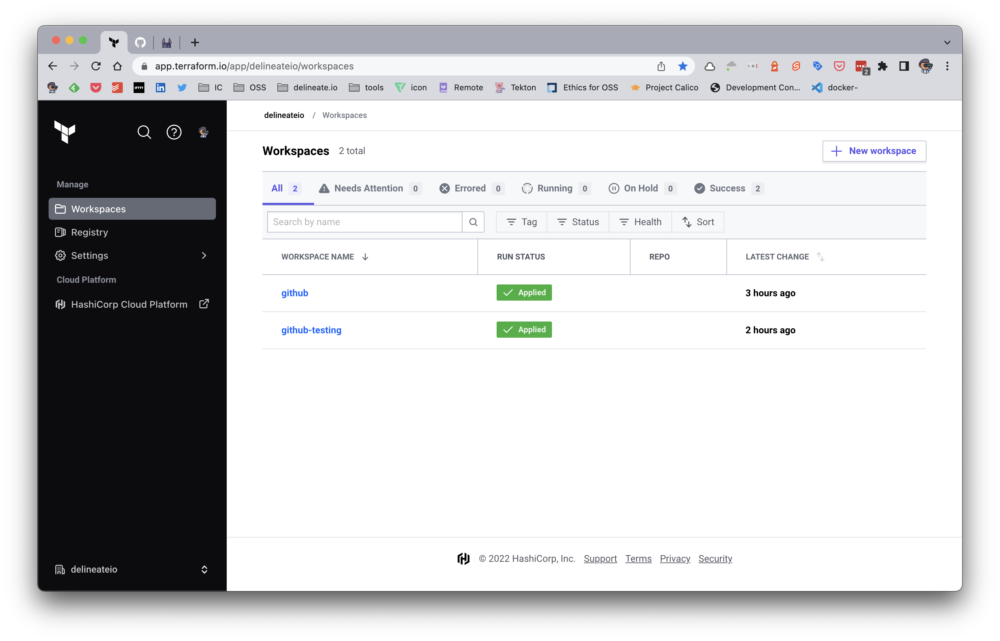

[![PRs Welcome][pr-welcome-shield]][pr-welcome-url]
[![Contributors][contributors-shield]][contributors-url]
[![Forks][forks-shield]][forks-url]
[![Stargazers][stars-shield]][stars-url]
[![Issues][issues-shield]][issues-url]
[![MIT License][license-shield]][license-url]

<!-- PROJECT LOGO -->
<br />
<p align="center">
  
  <h2 align="center">delineate.io</h2>
  <p align="center">portray or describe (something) precisely.</p>

  <h3 align="center">GitHub Terraform Management</h3>

  <p align="center">
    This repo demonstrates using Hashicorp Terraform to manage a GitHub organisation and it's repositories.
    <br />
    <a href="https://github.com/delineateio/hashicorp-terraform-github"><strong>Explore the docs »</strong></a>
    <br />
    <br />
    <a href="https://github.com/delineateio/hashicorp-terraform-github/issues">Report Bug</a>
    ·
    <a href="https://github.com/delineateio/hashicorp-terraform-github/issues">Request Feature</a>
  </p>
</p>

## Table of Contents

<!-- START doctoc generated TOC please keep comment here to allow auto update -->
<!-- DON'T EDIT THIS SECTION, INSTEAD RE-RUN doctoc TO UPDATE -->

- [About The Project](#about-the-project)
- [Built With](#built-with)
- [Terraform Cloud Setup](#terraform-cloud-setup)
- [Manage Repos](#manage-repos)
- [GitHub Automation](#github-automation)
- [Roadmap](#roadmap)
- [Contributing](#contributing)
- [License](#license)
- [Acknowledgements](#acknowledgements)

<!-- END doctoc generated TOC please keep comment here to allow auto update -->

<!-- ABOUT THE PROJECT -->
## About The Project

This repo provides a Terraform configuration to manage a GitHub organisation.

The solution uses Terraform Cloud as the centralised provisioning infrastructure to manage state and required secrets.  In this specific implementation two GitHub organisations are used, one for testing and one for production.

## Built With

Further logos can be inserted to highlight the specific technologies used to create the solution from [here](https://github.com/Ileriayo/markdown-badges).

| Syntax | Description |
| --- | ----------- |
|  | Pre-commit `git` hooks that perform checks before pushes|
|  | Source control management platform  |
|  | Providing of a standardised local environment |
|  | GitHub provisioning configuration|

<!-- GETTING STARTED -->
## Terraform Cloud Setup

A [Terraform Cloud](https://www.terraform.io/) account will be required.  In this example there are two workspaces defined, these workspaces are configured using Terraform remote backend files [here](./ops/cloud/config/).



Two env variables need to be configured in each Terraform Cloud workspace for GitHub

* `GITHUB_OWNER` should be set to the organisation slug
* `GITHUB_TOKEN` is the GitHub personal access token (PAT)

To create a new GitHub PAT then review the official documentation [here](https://docs.github.com/en/authentication/keeping-your-account-and-data-secure/creating-a-personal-access-token).

## Manage Repos

The repos to create and manage are defined in the `auto.tfvars` file [here](./ops/cloud/variables.auto.tfvars).  The following attributes can be confirmed per repo.

```h
name              = string
description       = string
homepage_url      = optional(string, "")
branch_protection = optional(bool, true)
default_branch    = optional(string, "main")
topics            = optional(list(string), [])
maintainers       = optional(list(string), [])
members           = optional(list(string), [])
visibility        = optional(string, "public")
archived          = optional(bool, false)
is_vercel_project = optional(bool, false)
is_template       = optional(bool, false)
```

<!-- GITHUB AUTOMATION -->
## GitHub Automation

For the exact configuration that runs review the [organisation](./ops/cloud/) config and [repo module](./ops/cloud/modules/).  The following commands can be used:

```shell
# Test organisation plan and apply
task test:plan
task test:apply

# Prod organisation plan and apply
task prod:plan
task prod:apply

```

<!-- ROADMAP -->
## Roadmap

See the [open issues](https://github.com/delineateio/hashicorp-terraform-github/issues) for a list of proposed features (and known issues).

<!-- CONTRIBUTING -->
## Contributing

Contributions are what make the open source community such an amazing place to be learn, inspire, and create. Any contributions you make are **greatly appreciated**.

1. Fork the Project
2. Create your Feature Branch (`git checkout -b feature/AmazingFeature`)
3. Commit your Changes (`git commit -m 'Add some AmazingFeature'`)
4. Push to the Branch (`git push origin feature/AmazingFeature`)
5. Open a Pull Request

If you would like to contribute to any delineate.io OSS projects please read:

* [Code of Conduct](https://github.com/delineateio/.github/blob/master/CODE_OF_CONDUCT.md)
* [Contributing Guidelines](https://github.com/delineateio/.github/blob/master/CONTRIBUTING.md)

<!-- LICENSE -->
## License

Distributed under the MIT License. See `LICENSE` for more information.

<!-- ACKNOWLEDGEMENTS -->
## Acknowledgements

* [Best README Template](https://github.com/othneildrew/Best-README-Template)
* [Markdown Badges](https://github.com/Ileriayo/markdown-badges)
* [DocToc](https://github.com/thlorenz/doctoc)

<!-- MARKDOWN LINKS & IMAGES -->
<!-- https://www.markdownguide.org/basic-syntax/#reference-style-links -->

[pr-welcome-shield]: https://img.shields.io/badge/PRs-welcome-ff69b4.svg?style=for-the-badge&logo=github
[pr-welcome-url]: https://github.com/delineateio/hashicorp-terraform-github/issues?q=is%3Aissue+is%3Aopen+label%3A%22good+first+issue
[contributors-shield]: https://img.shields.io/github/contributors/delineateio/hashicorp-terraform-github.svg?style=for-the-badge&logo=github
[contributors-url]: https://github.com/delineateio/hashicorp-terraform-github/graphs/contributors
[forks-shield]: https://img.shields.io/github/forks/delineateio/hashicorp-terraform-github.svg?style=for-the-badge&logo=github
[forks-url]: https://github.com/delineateio/hashicorp-terraform-github/network/members
[stars-shield]: https://img.shields.io/github/stars/delineateio/hashicorp-terraform-github.svg?style=for-the-badge&logo=github
[stars-url]: https://github.com/delineateio/hashicorp-terraform-github/stargazers
[issues-shield]: https://img.shields.io/github/issues/delineateio/hashicorp-terraform-github.svg?style=for-the-badge&logo=github
[issues-url]: https://github.com/delineateio/hashicorp-terraform-github/issues
[license-shield]: https://img.shields.io/github/license/delineateio/hashicorp-terraform-github.svg?style=for-the-badge&logo=github
[license-url]: https://github.com/delineateio/hashicorp-terraform-github/blob/master/LICENSE
